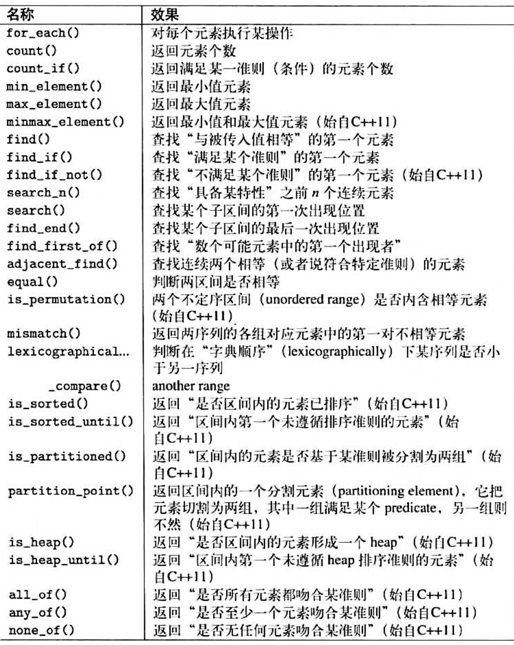

# STL算法

---

所有STL算法都被设计用来处理一个或多个iterator区间。第一个区间通常以起点和终点表示，其他区间在
多数情况下只需提供起点便足矣，其终点可自动以第一区间的元素数量推导出来。调用者必须确保这些区间的
有效性，也就是说起点和终点必须指向同一容器，且起点位置必须指向一个（与终点相较）较早出现或相同的
元素；其他区间必须有足够空间。

STL算法采用覆盖(overwrite)模式而非安插(insert)模式。所以调用者必须保证标的区间拥有足够的空间。
当然你也可以运用特殊的insert iterator将覆盖模式改变为安插模式。

为了提高灵活度和功效，某此STL算法元许使用者传递自定义操作，由STL算法调用之。这些操作既可以是寻常
函数，也可以是 function object，如果其返回值是个 Boolean，它们便被称为predicate(判断式)。

## 1. 算法分类

STL算法命名时引人了两个特殊后缀:
1. **后缀 _if** 如果某算法有两个形式，参数个数相同，但第一形式要求传人一个值，第二形式要求传人一
个函数或function object，那么后缀 _if 就派上用场。无后缀的那个要求数值，有后缀的那个要求的数或
function object。例如find()用来查找具有某值的元素， 而find_if()接受一个被当作查找准则的函数
或function object，查找第一个满足该准则的元素。
2. **后缀 _copy** 这个后缀用来表示在此算法中元素不只被操作，还会被复制到标的区问。例如reverse()
将区间中的元素颠倒次序，而 reverse_copy(〉则是逆序将元素复制到另一区间。

- 非更易型算法 (nonmodifying algorithm)
- 更易型第法 (modifying algorithm)
- 移除型算法 (removing algorithm)
- 变序型算法 (mutating algorithm)
- 排序算法 (sorting algorithm)
- 已排序区间算法 (sorted-range algorithm)
- 数值算法 (numeric algorithm)

### 1.1 非更易型算法(Nonmodifying Algorithm)
非更易型算法既不改动元素次序，也不改动元素值。他们可以通过迭代器和迭代器完成工作，因此可作用于所有
标准容器身上。

### 1.2 更易型算法(Modifying Algorithm)
更易型算法，要不是直接改变元素值，就是在复制元素到另一区间的过程中改变元素值（原区间不会发生改变）。

### 1.3 移除型算法(Removing Algorithm)
移除型算法是一种特殊的更易型算法，它们可以移除区间内的元素，也可以在复制过程中执行移除操作动作。

### 1.4 变序型算法(Mutating Algorithm)
所谓变序型算法是，通过元素值的赋值和互换 (assigning and swapping)，改变元素顺序，但不改变元素值。

### 1.5 排序算法(Sorting Algorithm)
更易型算法，要不是直接改变元素值，就是在复制元素到另一区间的过程中改变元素值（原区间不会发生改变）。

### 1.6 已排序区间算法 (Sorted-range Algorithm)
所谓已排序区间算法，意指其所作用的区间在某种排序准则下已排序 。

### 1.7 数值算法 (Numeric Algorithm)

