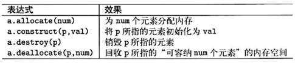

# Allocator(分配器)

Allocator表现出一种特殊内存模型(memory model)，被当成一种用来把“内存需求“转换
为“内存低级调用”的抽象层。如果在相同时间采用多个不同的allocator对象，你便可以在
同一个程序中采用不同的内存模型。

Allocator提供一份接口，可满足分配、生成、销毁和回收对象。 借由allocator容器和算
法的元素存储方式因而得以被参数化。例如你可以实现出运用共享内存(shared memory)的
allocator，或是让map的元素存储于持久性数据库(persistent database)。

# 1. Allocator基本操作

