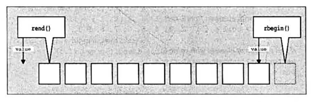

# 迭代器

## 1. 迭代器类型(Iterator Category)
Iterator(选代器)是一种“能够迭代某序列(sequence)内所有元素”的对象，可通过改编自寻常pointer
的一致性接口来完成工作。Iterator奉行一个纯抽象概念: 任何东西，只要行为类似iterator，就是一种iterator。
然而不同的iterator具有不同的能力(指的是其行进能力)。这很重要，因为某些算法需要特殊的iterator能力。
例如sorting算法需要的iterator必须能够执行随机访问(random access)，否则效能很糟。由于这个原因，选代器
被分为不同的类型。

| 迭代器种类 | 能力 | 提供者 |      
| :----------: | :----: | ------ |
| Output iterator    | 向前写入 |Ostream, inserter|
| Input iterator    | 向前读取一次 | Istream |
| Forward iterator    | 向前读取|Forward list, unordered containers |
| Bidirectional iterator     | 向前向后读取| List, set, multiset, map, multimap|
| Random access iterator    | 以随机访问方式读取|array, vector, deque, string|

### 1.1 Output iterator
Output iterator允许一步一步前行并搭配write动作。因此你可以一个一个元素地赋值，不能使用output iterator
对同一区间迭代两次，甚至不保证你可以将一个value 赋值两次而其迭代器却不累进。

| 表达式        | 效果 | 
| :----------: | :----: |
| *iter = val  | 将val写至迭代器所指位置|
| ++iter    | 向前步进(step forward)，返回新位置| 
| iter++    | 向前步进(step forward)，返回旧位置|
| TYPE(iter)| 复制迭代器(copy构造函数)|

### 1.2 Input iterator
Input iterator只能一次一个前行读取元素（只能读取元素一次）。按此顺序一个个返回元素值。

| 表达式        | 效果 | 
| :----------: | :----: |
| *iter     | 读取实际元素|
| iter->member    | 读取实际元素的成员（如果有的话）| 
| ++iter    | 向前步进(step forward)，返回新位置| 
| iter++    | 向前步进(step forward)，返回旧位置|
| iter1 == iter2    | 判断两个迭代器是否相等| 
| iter1 != iter2    | 判断两个迭代器是否不等|
| TYPE(iter)| 复制迭代器(copy构造函数)|

### 1.3 Forward iterator
Forward iterator是一种input迭代器且在前进读取时提供额外保。

| 表达式        | 效果 | 
| :-------: | :----:|
| *iter     | 访问实际元素|
| iter->member    | 访问实际元素的成员| 
| ++iter    | 向前步进(step forward)，返回新位置| 
| iter++    | 向前步进(step forward)，返回旧位置|
| iter1 == iter2    | 判断两个迭代器是否相等| 
| iter1 != iter2    | 判断两个迭代器是否不等|
| TYPE()| 构造迭代器(default构造函数)|
| TYPE(iter)| 复制迭代器(copy构造函数)|
| iter1 = iter2    | 对迭代器赋值(assign)|

### 1.4 Bidirectional iterator
Bidirectional iterator在forward迭代器基础上增加了回头能力，即支持递减操作。

| 表达式        | 效果 | 
| :---:       | :----:  |
| --iter    | 步退(返回新位置)| 
| iter--    | 步退(返回旧位置)|

### 1.5 Random-Access iterator
Random-Access iterator在bidirectional iterator的基础上增加了随机访问能力。因此它必须
提供iterator算术运算(和寻常 pointer的算术运算相当)。 也就是说，它能增减某个偏移量、计算距离(difference)，
并运用诸如<和>等关系操作符(relational operator)进行比较.

| 表达式        | 效果 | 
| :---:       | :----:  |
| iter[n]     | 访问索引位置为n的元素|
| iter+=n    | 前进n个元素（如果n是负数，则改为回退）| 
| iter-=n    | 回退n个元素（如果n是负数，则改为前进）| 
| iter+n   | 返回iter之后的第n个元素|
| n+iter   | 返回iter之后的第n个元素|
| iter-n   | 返回iter之前的第n个元素|
| iter1 - iter2    | 返回iter1和iter2之间的距离| 
| iter1 < iter2    | 判断iter1是否在iter2之前|
| iter1 > iter2    | 判断iter1是否在iter2之后|
| iter1 <= iter2    | 判断iter1是否不在iter2之后|
| iter1 >= iter2    | 判断iter1是否不在iter2之前|

## 2. 迭代器相关辅助函数

C++标准库为迭代器提供了一些辅助函数：advance(), next(), prev()和distance()
这四者提供给所有迭代器一些“原本只有 random access 迭代器才有”的能力: 
前进(或后退)多个元素，及处理迭代器之间的距离。

- advance()可将迭代器的位置增加，增加幅度由实参决定，也就是说它令迭代器一次前进（或后退）
多个元素。advance() 并不检查迭代器是否超过序列的end()(因为选代器通常不知道其所操作的容器，因此无从检查)。
所以，调用advance() 有可能导致不明确行为—-因为“对序列尾端调用operator++〞是一种未被定义的行为。
- next() 允许你前进移动迭代器的位置, 其内部对一个临时对象调用advance()。next()并不检查是否会跨越序列的end()。
因此调用者必须自行担保其结果有效。
- prev() 允许你前进移动迭代器的位置, 其内部对一个临时对象调用advance()。prev()并不检查是否会跨越序列的begin()。
因此调用者必须自行担保其结果有效。
- distance()用来处理两个迭代器之间的距离。如果不是random-access迭代器，则从pos1开始前进必须能够到达pos2，
亦即pos2的位置必须与pos1相同或在其后。对于random-access 迭代器，此函数仅仅是返回pos2-pos1 ，因此具备常量复杂度。
对于其他迭代器种类，distance()具备线性复杂度。因此 对于non-random-access 迭代器而言distance()的效能井不好，
应该避免使用。

## 3. 迭代器适配器(Iterator Adapter)

标准库提供的迭代器适配器使得算法能够以反向模式(reverse mode)或安插模式(insert mode)进行工作，
也可以和stream(串流)搭配工作

### 3.1 reverse iterator

Reverse iterator重新定义了递增运算和递减运算，使其行为正好颠倒。

容器的成员函数 rbegin()和 rend()各返回一个reverse迭代器，它们就像 begin()和 end()的返
回值一样，共同定义出一个半开区间 (half-openrange)：
- rbegin()返回反向迭代器的第一元素位置，也就是真实之最末元素的位置。
- rend()返回反向迭代器的最末元素的下一个位置，也就是真实之第一元素的前一个位置。
- 运用base()将reverse迭代器转回正常。

Reverse 迭代器所定义的区间，并不包括起点，反倒是包括了终点。然而逻辑上其行为一如往常。
这么一来reverse选代器物理意义所指的元素位置，和逻辑意义所指的元素位置就不一致。
该迭代器保持的究竟是逻辑位置 (value)还是物理位置 (element)?。物理位置维持不动， 变化的是
逻辑位置(也就是它所指的元素)，因此，其value(也就是其所指元素值)也就移到了前一个元素身上(如下图所示)。



## 4. 迭代器特性(Iterator Traits)

---
迭代器可以区分为不同类型(category)，每个类型都代表特定的迭代器能力。如果能根据不同的选代器
种类将操作行为重载 (overload)，将会很有用，甚至很必要。通过迭代器标志(tag)和特性(trait)
可以实现这样的重载。

### 4.1 iterator tag

```c
// 五种迭代器标志(iterator tag)
// 这里用到了继承。所以我们可以说任何forward迭代器都是一种(is a)input迭代器
struct input_iterator_tag {};
struct output_iterator_tag {};
struct forward_iterator_tag : public input_iterator_tag {};
struct bidirectional_iterator_tag : public forward_iterator_tag {};
struct random_access_iterator_tag : public bidirectional_iterator_tag {};
```

### 4.1 iterator traits
```c
template <class T>
struct iterator_traits
{
   typedef typename T::iterator_category iterator_category;
   typedef typename T::value_type        value_type;
   typedef typename T::pointer           pointer;
   typedef typename T::reference         reference;
   typedef typename T::difference_type   difference_type;
};
```

这个trait结构有两个优点:
1. 确保每一个选代器都提供了所有必要的类型定义。 
2. 能够针对特定的迭代器实施特化 (speciallization)。

```c++
// 针对原生指针的偏特化版本
template <class T>
struct iterator_traits<T*>
{
  typedef random_access_iterator_tag           iterator_category;
  typedef T                                    value_type;
  typedef T*                                   pointer;
  typedef T&                                   reference;
  typedef ptrdiff_t                            difference_type;
};
```


